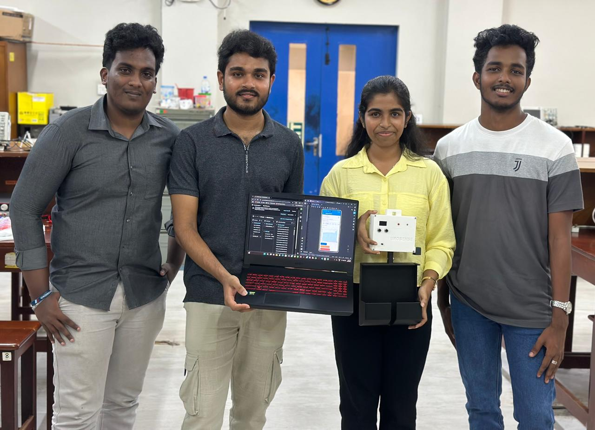
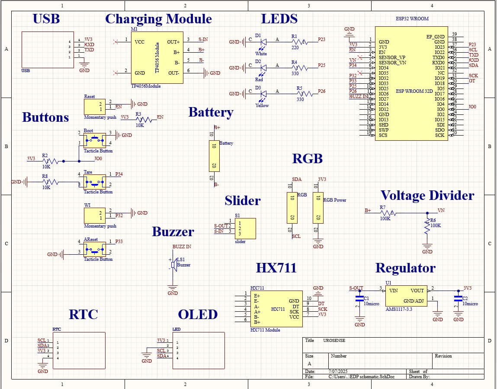
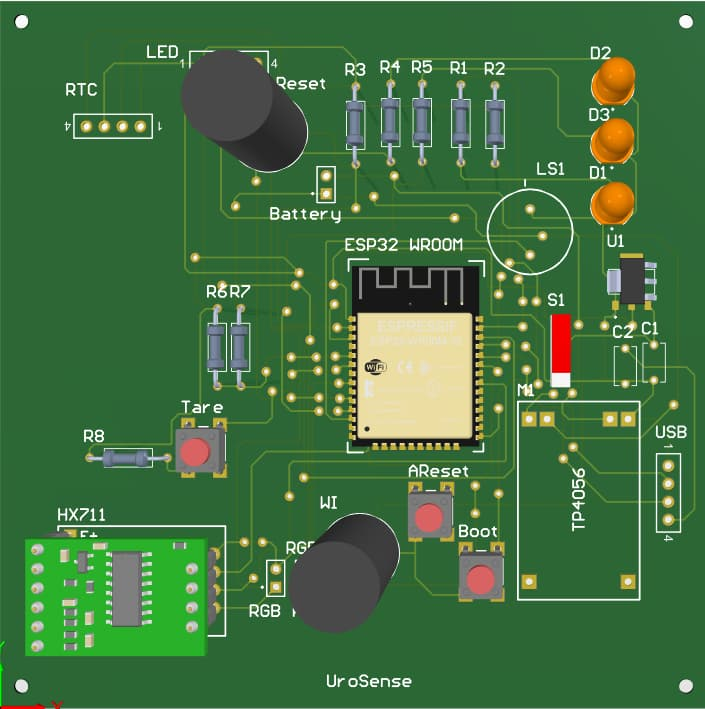
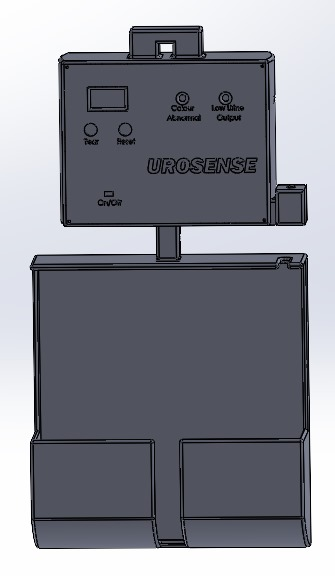
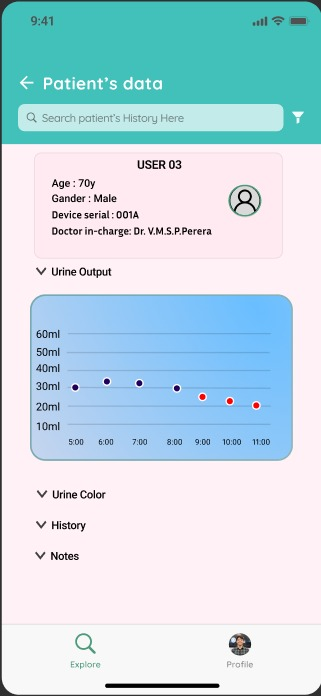

## Description
This project involves the design and development of an IoT-based smart urometer for continuous, real-time monitoring of urine output in clinical environments. A companion mobile application is integrated to enhance data accessibility and assist healthcare professionals in efficient patient monitoring

  

## Features
- IoT-enabled urine monitoring system
- Mobile and desktop application integration
- Real-time data processing and transmission
- Compact and lightweight design
- Cost-effective solution for hospitals

## Components Used
- **Microcontroller**: ESP32 WROOM
- **Load Sensor**: 5Kg load cell
- **Colour Sensor**: TCS34725
- **ADC Module**: HX711
- **Power Supply**: 9V battery & adapter
- **Mobile App**: Real-time monitoring and alert system

## Problem Statement
"There is a need for an affordable and reliable IoT-based urome
ter with mobile app integration in Sri Lankan hospitals to improve
 real-time urine level monitoring, reduce nurse workload, and ad
dress the inefficiencies of manual measurements"

## PCB Design

## How It Works
1. The UroSense collects urine volume data using a 5Kg load cell and HX711 ADC.
2. The ESP32 microcontroller processes and transmits data via Wi-Fi.
3. A mobile application displays real-time volume and triggers alerts when thresholds are breached.
4. The power supply ensures continuous operation with both adapter and battery backup.

## Device Enclosure

## Mobile APP

  

